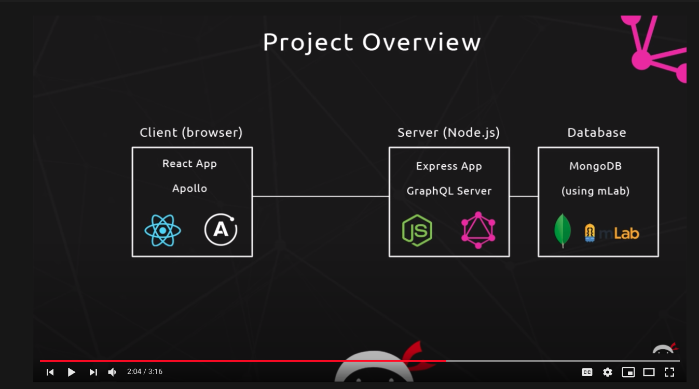
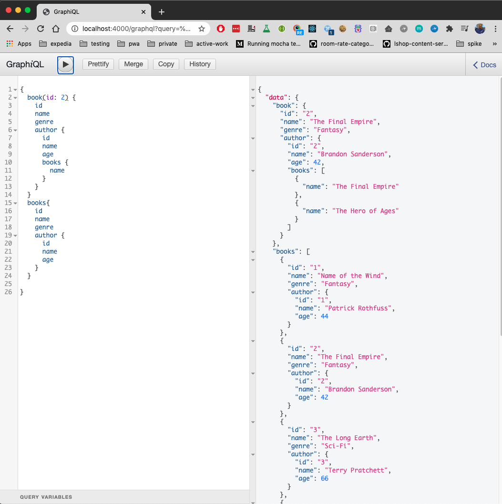

## React GraphQL Tutorial by Net Ninja

#### Overview

Developer Notes

    $ node -v
    v13.7.0

    $ npm install

    $ node app
    or
    $ nodemon app

Testing

- http://localhost:4000/graphql

- Explore the graphql Docs and make queries

Reference:
- https://www.youtube.com/watch?v=Y0lDGjwRYKw&list=PL4cUxeGkcC9iK6Qhn-QLcXCXPQUov1U7f&ab_channel=TheNetNinja